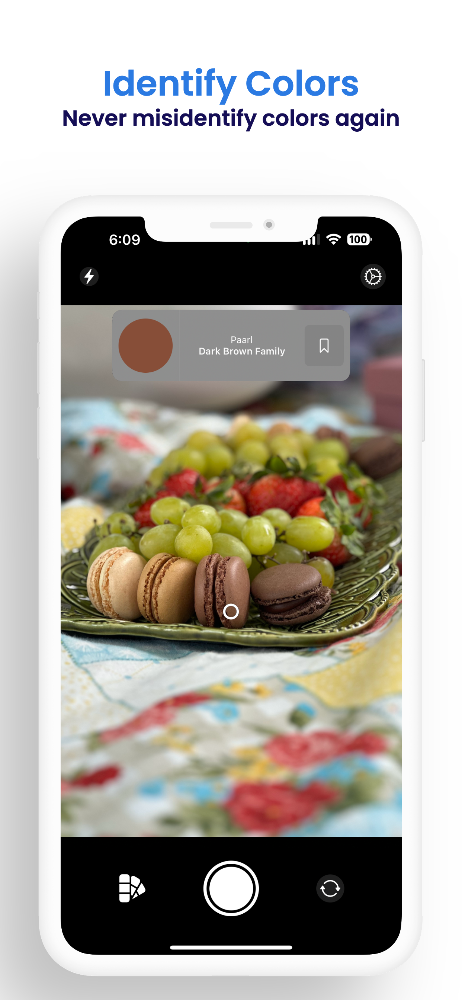
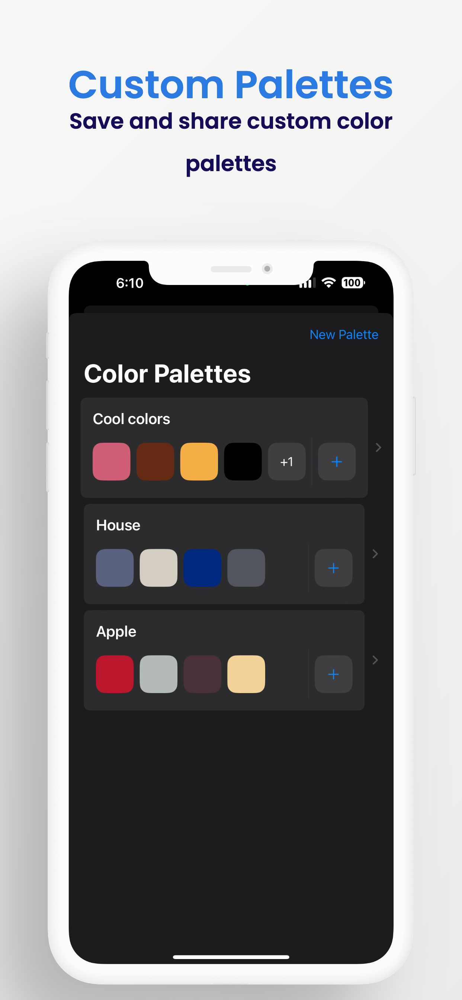
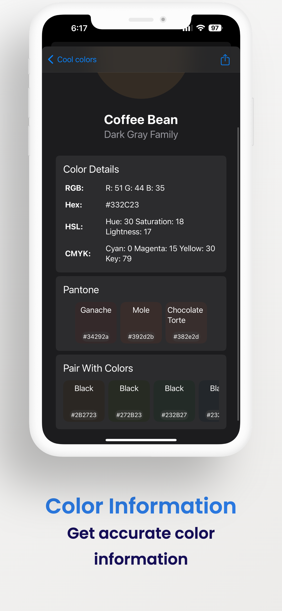

# ColorSense

**ColorSense** is an innovative application designed for designers and the colorblind. It allows users to capture colors from any object, save them to custom palettes, share them, and sync across all devices, including watchOS. It provides detailed color information and plans to support Pantone colors and matching/complementary colors in future updates.

## Features

- **Instant Color Capture**: Point your camera and tap to grab any color.
- **Custom Palettes**: Save and organize your colors into custom palettes.
- **Share Palettes**: Easily share your color palettes via a share link.
- **Sync Across Devices**: Sync your palettes across iPhone, iPad, and Apple Watch.
- **Detailed Color Information**: Get HSL, Hex, CMYK, RGB, and more.
- **Upcoming Features**: Pantone color support and matching/complementary color suggestions.

## Screenshots

*Capture Colors Instantly. Point your camera and tap to grab any color.*

*Save and Organize Your Colors. Create custom palettes and sync across all devices.*

*Get Detailed Color Info. HSL, Hex, CMYK, RGB, and more.*

## Installation

To install **ColorSense**, the app will soon be on app store soon, but for now you will have to download this project.

## Usage

1. Open the **ColorSense** app on your device.
2. Point your camera at any object to capture its color.
3. Tap on the screen to save the color to your custom palette.
4. Access detailed color information and manage your palettes.
5. Share your palettes via the share link button.
6. Sync your palettes across all your devices, including your Apple Watch.

## Support

If you encounter any issues or have any questions, please contact our support team:

- **Email**: wellsmjustin@gmail.com

## Contributing

We welcome contributions to improve **ColorSense**. If you’d like to contribute, please follow these steps:

1. Fork the repository.
2. Create a new branch (`git checkout -b feature-branch`).
3. Make your changes and commit them (`git commit -m 'Add new feature'`).
4. Push to the branch (`git push origin feature-branch`).
5. Open a Pull Request.

## License

**ColorSense** is licensed under the [MIT License](LICENSE).

## Acknowledgements

- Designed and developed by [Justin Wells](https://www.linkedin.com/in/virtualpixels/).
- Special thanks to our beta testers and everyone who provided feedback.

---

Thank you for using **ColorSense**! We hope it makes managing colors a delightful experience.
